# RFC Templates — Agent Execution Edition

These templates produce an RFC that an **AI coding agent can execute against an
existing repository** without follow-up clarification meetings. They are organised
around three pillars:

1. **Repo as documentation** — the agent reads the existing codebase first,
   anchored by a Repo Reading Guide. No design decision floats free of a real
   file path.
2. **Mermaid-first diagrams** — every architecture, sequence, ER, state, and
   branch diagram is a fenced ` ```mermaid ` block so the agent can read, render,
   and edit the diagram in-place. Do **not** reference draw.io, Lucidchart,
   Excalidraw, or external image links for primary diagrams.
3. **Executable call-to-action** — the §4 Execution Plan emits ordered chunks
   the agent runs: files to touch, commands to run, signals to verify, rollback
   recipe to reverse.

The Confluence governance shell is preserved verbatim — **metadata table** at
the top + numbered sections **1. Overview**, **2. Technical Design**,
**3. High-Availability & Security**, **4. Backwards Compatibility and Rollout
Plan**, **5. Concern, Questions, or Known Limitations**, **6. Comment logs** —
mirroring the Qontak RFC Template. Agent-execution content lives inside those
sections.

To make the same RFC also agent-friendly, every template header carries:

- **YAML frontmatter** at the very top — the machine-readable index an agent
  parses without scraping the table.
- A **Document Conventions** callout — combined governance + agent-execution
  rules.
- An expanded **Metadata** table (3 columns: field / value / notes) — the
  visible governance record that humans read.
- A **Sections at a Glance** index — stable navigation map.

The frontmatter and metadata table must agree (status, owner, type, etc.).
ISO-8601 (`YYYY-MM-DD`) for every date. Status values:
`IDEA` | `RFC` | `ABANDON` | `AGREED`.

## Rules of use

1. Pick exactly one template based on scope: **Frontend**, **Backend**, or
   **Full-Stack**.
2. The frontmatter, metadata table, and Confluence sections 1–6 + Comment
   logs are mandatory. Mark `N/A — reason` only when truly inapplicable —
   never delete a section.
3. Every `[REQUIRED: …]` placeholder must be filled before the RFC is handed
   to an executing agent. Never leave `TBD`, `to be decided`, or dangling
   `X or Y` wording.
4. Every diagram must be a mermaid fenced block. If a concept does not fit
   mermaid (e.g. a UI screenshot), embed the asset link as a supplement, not
   as the primary spec.
5. Frontmatter and metadata table must agree on every shared field. Bump
   `last_updated` (and the matching table row) on every material edit.
6. The final gate is **§7 Ready for agent execution** — a self-check from the
   author that the RFC is concrete enough to hand to an autonomous coding
   agent. Optional reviewer handoff is a footnote, not the gate.

---

## Frontend RFC Template

````markdown
---
status: IDEA              # IDEA | RFC | ABANDON | AGREED
type: frontend
sub_type: new-feature     # new-feature | enhancement | performance
title: <RFC title>
owner: <team>             # e.g. Talenta Growth
authors:
  - <name>
reviewers:
  - <name>                # tech reviewers across affected squads
approvers:
  - <name>                # tech leaders + infosec approver
submitted_date: YYYY-MM-DD
last_updated: YYYY-MM-DD
target_release: <vX.Y.Z | YYYY-Qn | YYYY-MM-DD>
related_documents:
  - <PRD link or path>    # at least one, or "no-PRD — reason"
discussion: <Slack channel / thread URL>
---

# RFC: <title>

> **Document Conventions** _(do not remove)_
>
> This RFC follows the Qontak RFC Template format for governance — the
> metadata table, Confluence sections **1–6**, and **Comment logs** are
> mandatory. Replace placeholder values; mark sections `N/A — reason` when
> truly inapplicable rather than deleting them.
>
> It is also **agent-execution-ready**: the §1 Design References, §2 Repo
> Reading Guide (Detail 2.0), mermaid diagrams, and §4 Agent Execution Plan
> + Verification & Rollback Recipe must be complete before §7 Ready for
> agent execution: yes.
>
> The YAML frontmatter at the very top is the machine-readable index agents
> parse. The metadata table below is the human-readable governance record.
> **Both must agree** on every shared field (status, owner, type, dates).

## Metadata

| Field | Value | Notes |
| --- | --- | --- |
| **Status** | <status_value> | `IDEA` / `RFC` / `ABANDON` / `AGREED` |
| **Owner** | <owner_value> | Team owning the RFC (e.g. Talenta Growth) |
| **Author(s)** | <author_value> | Primary author(s) |
| **Reviewers** | <reviewer_value> | Tech reviewers across affected squads |
| **Approver(s)** | <approver_value> | Tech leaders + **infosec approver** |
| **Submitted Date** | <submitted_date> | ISO-8601 (`YYYY-MM-DD`); date RFC opened for discussion |
| **Last Updated** | <last_updated> | ISO-8601; bump on every material edit |
| **Target Release** | <target_release> | Version, quarter, or date |
| **Related Documents** | <related_docs_value> | PRD, design, prior RFCs (at least one — or `no-PRD — reason`) |
| **Discussion** | <discussion_value> | Slack channel / thread URL |

**Type:** frontend
**Sub-type:** new-feature | enhancement | performance

## Sections at a Glance

1. Overview _(incl. §1 Design References — Figma, design system version, design QA)_
2. Technical Design _(Repo Reading Guide → mermaid architecture → UI contracts → Asset Inventory)_
3. High-Availability & Security
4. Backwards Compatibility and Rollout Plan _(incl. §4 Agent Execution Plan + Verification & Rollback Recipe)_
5. Concern, Questions, or Known Limitations
6. Comment logs
7. Ready for agent execution

---

## 1. Overview

[REQUIRED: Problem statement. What does this project do in the grand scheme of the system?
Is this a comprehensive specification or a delta on prior work?]

### Success Criteria
[REQUIRED: prioritized list of high-level outcomes the system must achieve.
Quantify where possible — conversion %, task completion rate, perceived speed delta.]

### Out of Scope
[REQUIRED: explicit non-goals. Anything previously discussed but NOT built this iteration
(e.g., support for legacy app version, exclusion of particular customer segments).]

### Related Documents
[REQUIRED: PRD, design, user research, prior RFCs. For delta specs, link the previous version.]

### Assumptions
[REQUIRED: list assumptions for this iteration.]

### Dependencies
[REQUIRED: external & internal — backend endpoints (with availability status: exists / needs building / blocked),
third-party packages with version + bundle delta, design system components, feature flags, cross-team owners.]

### Design References _(frontend-specific — required)_
Frontend RFCs must anchor in design. The agent reads Figma alongside the repo
to know what to build pixel-for-pixel. List every Figma frame in scope, plus
the design system version and the design QA contact.

| PRD-named surface | Figma / design link | Frame name | Design system version | Design QA contact | Notes |
|---|---|---|---|---|---|
| [REQUIRED] | [REQUIRED — direct link to the frame, not the file root] | [REQUIRED] | [REQUIRED — e.g. `@mekari/ds@4.7.2`] | [REQUIRED] | [REQUIRED — e.g. "uses new `<Drawer/>` v2.4 from DS"] |

If no Figma frame exists yet, write `n/a — design pending` and add the missing
frame to §5 Open Questions; do not start implementation chunks against
imagined designs.

### Detail 1.A — PRD Traceability Matrix
The agent uses these tables to confirm coverage before opening a PR.

Forward (PRD → RFC):
| PRD requirement | RFC section | Component / file |
|---|---|---|
| [REQUIRED] | [REQUIRED] | [REQUIRED] |

Reverse (RFC → PRD):
| New component / RFC decision | PRD requirement driving it |
|---|---|
| [REQUIRED] | [REQUIRED] |

#### UI / Consumer Surface Coverage
| PRD-named surface | Consumer | Required reads (BE endpoint) | Required writes (BE endpoint) | Status surface (which field/event reflects state) |
|---|---|---|---|---|
| [REQUIRED — every page/modal/panel/chatbot flow/magic-link view from PRD] | web/chatbot/mobile/support | [REQUIRED] | [REQUIRED] | [REQUIRED] |

#### Role Coverage
| PRD role | UI surface visibility | Action buttons enabled | Auth scope expected from BE | Notes |
|---|---|---|---|---|
| [REQUIRED — every role from PRD, including support / read-only / internal] | [REQUIRED] | [REQUIRED — list disabled buttons for read-only roles] | [REQUIRED] | [REQUIRED] |

#### PRD Section Coverage
| PRD section # | Title | Where covered (RFC section) or `n/a — reason` |
|---|---|---|
| [REQUIRED — one row per numbered PRD section] | [REQUIRED] | [REQUIRED] |

> No-PRD exception: tech-debt or perf RFCs may have no PRD. Replace this matrix with a
> self-contained problem + success criteria + non-goals statement.

### Detail 1.B — Decisions Closed
| Decision | Chosen option | Alternatives rejected | Why rejected |
|---|---|---|---|
| [REQUIRED] | [REQUIRED] | [REQUIRED — or `no alternative considered — [reason]`] | [REQUIRED — or `n/a — single viable option`] |

> Honesty rule: if no alternative was seriously considered, write `no
> alternative considered — [reason]` rather than fabricate a rejected option.

### Detail 1.C — Per-Story Change Map _(human-readable index, organised by user story)_

For every PRD user story in scope, list which layer(s) it touches and which
concrete artifacts change. This is the **story-centric** index that
complements Detail 1.A's technical-centric matrices: a reviewer can scan one
row to know exactly what a story requires, where it lands, and how to verify
it — without crawling the DDL / API / state tables in §2.

**Layer scope values** _(use the one that fits)_:

- `FE-only` — frontend changes only; no BE work this RFC.
- `FE + BE existing` — frontend changes consume an already-shipped BE endpoint
  (cite endpoint + repo path).
- `FE + BE new` — frontend depends on a BE endpoint not yet built; **list the
  separate BE RFC link** or treat this story as `blocked — BE RFC needed`.
- `Runtime / behavior` — no API surface change; behavior change at runtime
  (e.g. analytics event, debounced effect, browser API call).
- `Config` — feature flag, env var, design-system token only.
- `Cross-squad` — work owned by another squad (Design, Platform, Data team);
  link the issue or RFC.

| Story # | Story title (from PRD §13b) | Layer scope | Changes (concrete FE artifacts + cross-layer references) | Acceptance criteria (verifiable) | RFC anchors |
|---|---|---|---|---|---|
| [REQUIRED — e.g. M1] | [REQUIRED — short title] | [REQUIRED — pick value(s) from list above] | [REQUIRED — bulleted: components / hooks / pages / store slices / events / Figma frames; for `FE + BE *` rows, name the BE endpoint + status (exists / blocked)] | [REQUIRED — assertable, tied to PRD §13b AC, e.g. "snapshot test passes; analytics event `feature.action` fires with correct payload"] | [REQUIRED — RFC sections containing the detail, e.g. "§2.A row 3 · §4.C chunk 5 · §1 Design References row 2"] |

> Coverage rule: every PRD-listed user story must appear here exactly once.
> If a story is out-of-scope for this FE RFC, write `n/a — covered in <BE RFC
> link>` so traceability stays complete. Silent omission is a blocker.

---

## 2. Technical Design

### Detail 2.0 — Repo Reading Guide _(read this first; the agent must understand the existing code as documentation before writing any new code)_

#### Repo Map (mermaid)
Show the slice of the repository this RFC touches. Group by feature/module folder
so the agent knows where to navigate. Keep nodes to ≤ 12 for readability — split
into multiple diagrams if needed.
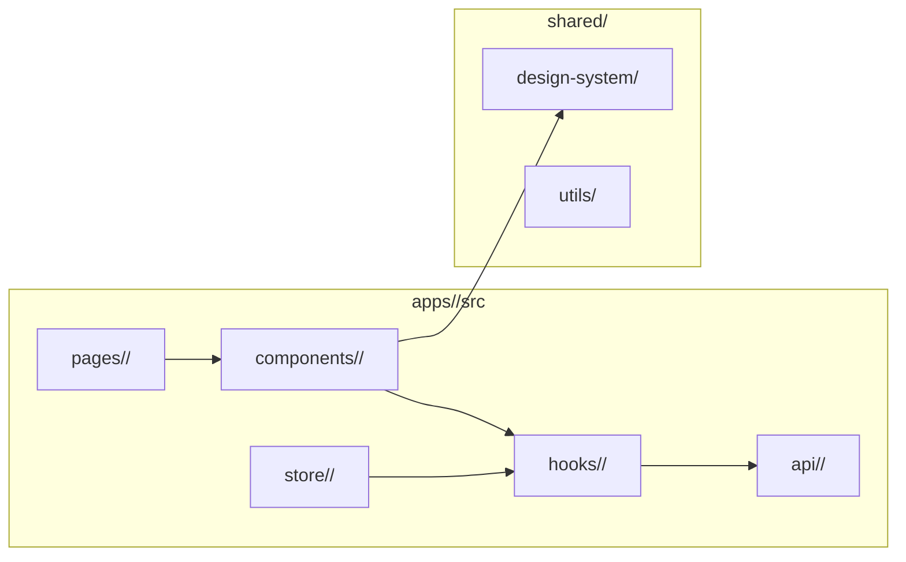

#### Existing Code Anchors
The exact files the agent must read **before** writing new code. Each row links a
real file in the current branch.
| Path | Why the agent reads it | What pattern it teaches |
|---|---|---|
| [REQUIRED — e.g. `apps/web/src/pages/orders/OrderList.tsx`] | [REQUIRED — e.g. "matches list pagination + empty/error pattern we extend"] | [REQUIRED — e.g. "uses `useInfiniteQuery` + `<EmptyState/>`"] |

#### Patterns to Follow (and where to find them)
| Concern | Pattern in repo | Reference file | Deviation in this RFC? |
|---|---|---|---|
| State management | [REQUIRED — e.g. Redux Toolkit slice] | [REQUIRED — file path] | [REQUIRED or "none"] |
| Folder convention | [REQUIRED] | [REQUIRED] | [REQUIRED or "none"] |
| Styling | [REQUIRED — e.g. Tailwind + cva] | [REQUIRED] | [REQUIRED or "none"] |
| Error / toast / retry | [REQUIRED] | [REQUIRED] | [REQUIRED or "none"] |

#### Reading Order for the Agent
A numbered list — read these files top to bottom before opening the first chunk
in the Execution Plan. Keep ≤ 10 entries; the goal is shared mental model, not
exhaustive reading.
1. [REQUIRED — file path + 1-line "what to learn"]
2. [REQUIRED]
3. …

#### Source Verification _(anti-hallucination — required)_
One row per anchor / pattern / contract above. Confirm each path is real and
opened, with concrete evidence. If any row cannot be filled, treat it as a
blocker (move to §5 Open Questions) — do not invent.

| Anchor / pattern / contract | Verified by | Evidence (1-line: function name, exported symbol, line range, or quoted identifier) |
|---|---|---|
| [REQUIRED — same path as above] | read / ls / grep | [REQUIRED — e.g. "exports `useOrderList` at L42; uses `useInfiniteQuery`"] |

#### Design ↔ Code Mapping _(frontend-specific — required)_
For every Figma frame in §1 Design References, name the implementing file(s)
and tokens used. This is the agent's bridge from design to code.

| Figma frame / component | Implementing file (path) | Reuse vs new | Design tokens used (color / space / typography) | Deviation from design |
|---|---|---|---|---|
| [REQUIRED] | [REQUIRED] | reused / extended / new | [REQUIRED — e.g. `color.surface.brand`, `space.4`, `text.heading.lg`] | [REQUIRED or "none — pixel-faithful"] |

> If a frame requires a deviation, the deviation must be approved by the
> Design QA contact named in §1 Design References before the chunk lands.

### Detail 2.1 — Architecture (mermaid)

#### Component diagram
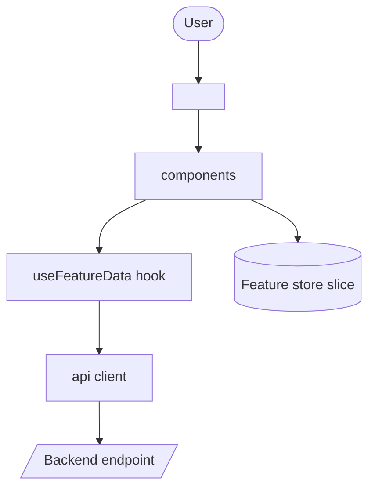

#### State machine (per UI flow with non-trivial states)
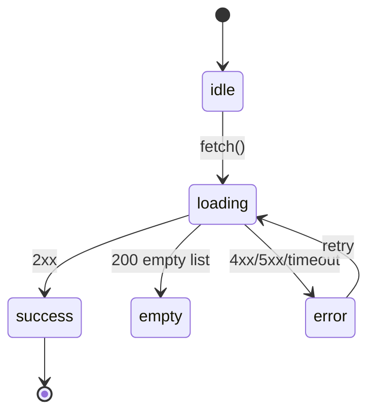

### Detail 2.2 — Sequence (mermaid, one per scenario incl. failure paths)
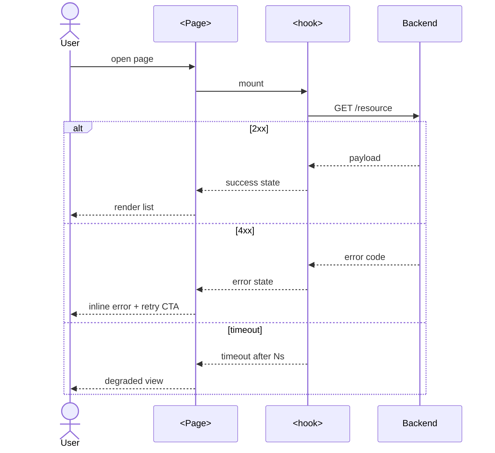

### Detail 2.3 — Database Model
N/A for pure frontend RFC. Document any client-side persistence (localStorage / IndexedDB / cookies):
shape, migration path, eviction policy.

### Detail 2.4 — APIs Consumed
[REQUIRED: list every backend endpoint consumed — method, path, availability status
(exists / needs building / blocked), and reference to the contract authority
(backend RFC link, Swagger/OpenAPI spec). Do NOT start dev without an agreed contract.]

| Method | Path | Status | Contract authority | Notes |
|---|---|---|---|---|
| [REQUIRED] | [REQUIRED] | exists / needs-building / blocked | [REQUIRED] | [REQUIRED] |

### Detail 2.A — UI Contract
For every component introduced or significantly modified:
- **Figma frame URL** (must match a row in §1 Design References): [REQUIRED]
- **Implementation file path**: [REQUIRED — e.g. `apps/web/src/components/<feature>/<X>.tsx`]
- **Props type**:
```typescript
interface <ComponentName>Props {
  [REQUIRED: typed prop fields with required/optional + defaults]
}
```
- State shape & ownership (which store / context / hook): [REQUIRED]
- Event payloads — analytics + custom events with exact name + properties: [REQUIRED]
- Conditional rendering: example payload per branch: [REQUIRED]
- Slots / children contract (if any): [REQUIRED or "none"]
- A11y notes (role, aria-*, focus order) tied to design: [REQUIRED]

### Detail 2.B — Data-Fetching Strategy
- Library: [REQUIRED: SWR / React Query / RTK Query / Apollo / Pinia / fetch / …]
- Cache key structure: [REQUIRED]
- TTL & refetch triggers (mount / focus / interval / event): [REQUIRED]
- Stale-while-revalidate behavior: [REQUIRED yes/no + behavior]
- Optimistic updates + rollback on failure: [REQUIRED yes/no + mechanism]

### Detail 2.C — UI State Matrix
For every data-driven surface, define ALL FIVE states.
| Surface | Loading | Empty | Error | Partial | Success |
|---|---|---|---|---|---|
| [REQUIRED] | [REQUIRED] | [REQUIRED] | [REQUIRED] | [REQUIRED] | [REQUIRED] |

### Detail 2.D — Scope Boundaries
- Files to create (paths): [REQUIRED]
- Files to modify (paths + reason): [REQUIRED]
- Files explicitly NOT touched (non-goals): [REQUIRED]
- Shared components touched + impact analysis (e.g., Button used in 47 places): [REQUIRED]

### Detail 2.E — State Surface Contract
For every entity whose state the FE renders (status badges, progress timelines,
notification dots, etc.):
| Entity | State field / event consumed | Default values | Source endpoint / event | Stale-tolerance window |
|---|---|---|---|---|
| [REQUIRED] | [REQUIRED] | [REQUIRED] | [REQUIRED] | [REQUIRED] |

> Every UI surface from Detail 1.A that displays state info must trace its
> contributing fields back to a row here.

### Detail 2.F — Asset Inventory _(frontend-specific)_
Every icon / illustration / image / lottie / font the RFC introduces or
swaps. The agent uses this to know what to import vs export from Figma.

| Asset name | Type (icon / illustration / image / lottie / font) | Source (design system / new export from Figma / 3rd-party) | Format & sizes (e.g. SVG; PNG @1x/2x/3x; WebP) | Path in repo |
|---|---|---|---|---|
| [REQUIRED] | [REQUIRED] | [REQUIRED] | [REQUIRED] | [REQUIRED] |

> Use design-system assets where possible; flag every new asset for design
> review before merge.

---

## 3. High-Availability & Security

[REQUIRED: HA narrative — graceful degradation when API is slow/down, offline behavior,
recovery from transient failures.]

### Performance Requirement
- LCP target: [REQUIRED]
- INP target: [REQUIRED]
- CLS target: [REQUIRED]
- Bundle size budget + delta vs current: [REQUIRED]
- Code-splitting strategy (route-level / component-level): [REQUIRED]
- Image strategy (WebP/AVIF, lazy-loading, responsive sizing): [REQUIRED]
- Browser support matrix (Chrome/Safari/Firefox/Edge versions, iOS Safari): [REQUIRED]
- Responsive breakpoints + touch targets: [REQUIRED]
- i18n / l10n / RTL: [REQUIRED]

### Monitoring & Alerting
- Analytics events — exact event name + properties + when fires: [REQUIRED]
- Error monitoring (Sentry/Datadog) — severity + sample rate + alert thresholds: [REQUIRED]
- Core Web Vitals tracked + dashboard location: [REQUIRED]
- User-facing success metric tied to PRD (conversion / completion / perceived speed): [REQUIRED]

### Logging
- Frontend log fields + level: [REQUIRED]
- PII removed from logs (which fields scrubbed): [REQUIRED]

### Security Implications
- Threat model (XSS, CSRF, third-party script supply chain, clickjacking): [REQUIRED]
- Input sanitization rules per field: [REQUIRED]
- `dangerouslySetInnerHTML` / `v-html` usage + sanitization library: [REQUIRED or "none"]
- Auth token storage (httpOnly cookie / localStorage / memory) + refresh flow: [REQUIRED]
- HTTPS-only resources + CSP additions: [REQUIRED]
- PII handling in client (UU PDP / GDPR / ISO 27701 triggers): [REQUIRED yes/no + classification + retention]
- Secret management (no hard-coded keys; reference to Hashi Vault / config service): [REQUIRED]

### Detail 3.A — Failure Mode Catalog
| API call | 401 | 403 | 404 | 429 | 500 | Timeout (s) | Offline | Retry mechanism |
|---|---|---|---|---|---|---|---|---|
| [REQUIRED] | [REQUIRED] | [REQUIRED] | [REQUIRED] | [REQUIRED] | [REQUIRED] | [REQUIRED] | [REQUIRED] | [REQUIRED] |

Plus narrative for: rapid-click race conditions, navigation-during-fetch, third-party script load failure,
WebSocket reconnect with stale state.

### Detail 3.B — Error Message Catalog
| Error code | User-facing message (i18n key) | Surface (toast/inline/banner) | User-facing? |
|---|---|---|---|
| [REQUIRED] | [REQUIRED] | [REQUIRED] | yes/no |

### Detail 3.C — Accessibility
- WCAG level: AA minimum
- Keyboard navigation flow: [REQUIRED]
- Focus management (modal open/close, route change, dialog dismiss): [REQUIRED]
- ARIA labels on non-semantic interactive elements: [REQUIRED]
- Color contrast ratios verified (tool + result): [REQUIRED]
- `prefers-reduced-motion` handling: [REQUIRED]

---

## 4. Backwards Compatibility and Rollout Plan

### Compatibility
- API contracts changed (request/response shape diff): [REQUIRED or "none"]
- Saved client state (localStorage / cookies / service worker cache) compatibility: [REQUIRED]
- Old bundle / CDN cache invalidation strategy: [REQUIRED]

### Rollout Strategy
- Feature flag name + default state + provisioner + targeting rules: [REQUIRED]
- Rollout stages (internal → 1% → 10% → 100%) with audience + go/no-go evidence: [REQUIRED per stage]
- Stop conditions — specific metric thresholds or error patterns: [REQUIRED]
- Rollback mechanism + behavior for users mid-session: [REQUIRED]
- Blast radius (worst case affected users / surfaces): [REQUIRED]
- PIC + timeline per stage: [REQUIRED]

### Detail 4.A — Configuration Contract
| Env var / build config / flag | Type | Default | Required | Provisioner |
|---|---|---|---|---|
| [REQUIRED] | [REQUIRED] | [REQUIRED] | yes/no | [REQUIRED] |

### Detail 4.B — Test Plan (commands the agent will run)
List exact commands, not test types in the abstract. **Commands must be sourced
from the repo** (`package.json` scripts, `Makefile`, `Justfile`,
`.github/workflows/*`, `Taskfile.yml`, etc.) — do not invent.
| Layer | Command (source: file + line) | What it must prove |
|---|---|---|
| Unit | [REQUIRED — e.g. `pnpm test --filter web -- src/components/<X>`] | [REQUIRED] |
| Integration | [REQUIRED] | [REQUIRED] |
| E2E | [REQUIRED — e.g. `pnpm playwright test e2e/<feature>.spec.ts`] | [REQUIRED] |
| Visual regression | [REQUIRED or "n/a — reason"] | [REQUIRED] |
| Accessibility (axe) | [REQUIRED] | [REQUIRED] |
| Performance / bundle | [REQUIRED — e.g. `pnpm size-limit`] | [REQUIRED] |

### Detail 4.C — Agent Execution Plan
Each chunk is a discrete unit the agent can execute and verify. **Order matters**:
the agent finishes chunk N (and its acceptance criteria pass) before opening N+1.

| Order | Chunk | Files to modify/create | Commands to run | Acceptance criteria (verifiable) |
|---:|---|---|---|---|
| 1 | [REQUIRED — e.g. "Add `<FeatureList/>` skeleton"] | [REQUIRED — exact paths] | [REQUIRED — lint+test commands] | [REQUIRED — assertable, e.g. "snapshot test passes; story renders"] |

### Detail 4.D — Verification & Rollback Recipe
- **Pre-merge verification commands** (the agent runs these in order):
  1. [REQUIRED — e.g. `pnpm lint`]
  2. [REQUIRED — e.g. `pnpm typecheck`]
  3. [REQUIRED — e.g. `pnpm test`]
  4. [REQUIRED — e.g. `pnpm build`]
- **Post-deploy verification signals** (named metric / log query / dashboard URL):
  - [REQUIRED]
- **Rollback recipe** (concrete steps, in order, the agent can execute):
  1. [REQUIRED — e.g. "Toggle flag `feature.<x>` off in LaunchDarkly"]
  2. [REQUIRED — e.g. "Revert PR #<n>"]
  3. [REQUIRED — e.g. "Confirm Sentry error rate < 0.1% in next 15 min"]

---

## 5. Concern, Questions, or Known Limitations

[REQUIRED: open questions for reviewer attention; known limitations (rate limit, machine cap);
future scalability plans (e.g., partitioning, sharding, server components migration).]

---

## 6. Comment logs

| **Date** | **Comment(s) From** | **Action Item(s)** |
| --- | --- | --- |
|  |  |  |
|  |  |  |

---

## 7. Ready for agent execution

- yes | no
- If no, list exactly what is missing from these execution-readiness gates:
  - **§1 Design References** — every PRD-named surface has a direct Figma frame link, design system version, and design QA contact
  - **Detail 1.C Per-Story Change Map** — every PRD user story has exactly one row with layer scope + concrete FE changes + verifiable AC; out-of-scope stories say `n/a — covered in <BE RFC link>`
  - Repo Reading Guide (Detail 2.0) — anchors named, reading order set
  - **Source Verification table complete** — every anchor / pattern / contract has concrete evidence (no plausible-but-unverified rows)
  - **Detail 2.0 Design ↔ Code Mapping** — every Figma frame mapped to an implementing file with tokens
  - Mermaid diagrams for architecture, state, sequence
  - UI Contract (Detail 2.A) typed; every component cites its Figma frame URL + implementation file path; data-fetching strategy concrete
  - UI State Matrix complete (5 states per surface)
  - **Asset Inventory (Detail 2.F)** — every new asset has source, format, repo path
  - Failure Mode Catalog complete + Error Message Catalog complete
  - Configuration Contract complete; flag named with default
  - Agent Execution Plan: every chunk has files + commands + acceptance criteria
  - Verification & Rollback Recipe: commands runnable; signals named

> Optional: hand off to `rfc-reviewer` for a second-pass score after this gate
> is `yes`. The reviewer is supplementary; this gate is the agent-execution
> contract.
````

---

## Backend RFC Template

````markdown
---
status: IDEA              # IDEA | RFC | ABANDON | AGREED
type: backend
sub_type: new-feature     # new-feature | enhancement | tech-improvement
title: <RFC title>
owner: <team>             # e.g. Talenta Growth
authors:
  - <name>
reviewers:
  - <name>                # tech reviewers across affected squads
approvers:
  - <name>                # tech leaders + infosec approver
submitted_date: YYYY-MM-DD
last_updated: YYYY-MM-DD
target_release: <vX.Y.Z | YYYY-Qn | YYYY-MM-DD>
related_documents:
  - <PRD link or path>    # at least one, or "no-PRD — reason"
discussion: <Slack channel / thread URL>
---

# RFC: <title>

> **Document Conventions** _(do not remove)_
>
> This RFC follows the Qontak RFC Template format for governance — the
> metadata table, Confluence sections **1–6**, and **Comment logs** are
> mandatory. Replace placeholder values; mark sections `N/A — reason` when
> truly inapplicable rather than deleting them.
>
> It is also **agent-execution-ready**: the §1 PRD-to-Schema Derivation
> (backend RFCs do not require Figma), §2 Repo Reading Guide (Detail 2.0),
> mermaid diagrams, and §4 Agent Execution Plan + Verification & Rollback
> Recipe must be complete before §7 Ready for agent execution: yes.
>
> The YAML frontmatter at the very top is the machine-readable index agents
> parse. The metadata table below is the human-readable governance record.
> **Both must agree** on every shared field (status, owner, type, dates).

## Metadata

| Field | Value | Notes |
| --- | --- | --- |
| **Status** | <status_value> | `IDEA` / `RFC` / `ABANDON` / `AGREED` |
| **Owner** | <owner_value> | Team owning the RFC (e.g. Talenta Growth) |
| **Author(s)** | <author_value> | Primary author(s) |
| **Reviewers** | <reviewer_value> | Tech reviewers across affected squads |
| **Approver(s)** | <approver_value> | Tech leaders + **infosec approver** |
| **Submitted Date** | <submitted_date> | ISO-8601 (`YYYY-MM-DD`); date RFC opened for discussion |
| **Last Updated** | <last_updated> | ISO-8601; bump on every material edit |
| **Target Release** | <target_release> | Version, quarter, or date |
| **Related Documents** | <related_docs_value> | PRD, prior RFCs, ADRs (at least one — or `no-PRD — reason`) |
| **Discussion** | <discussion_value> | Slack channel / thread URL |

**Type:** backend
**Sub-type:** new-feature | enhancement | tech-improvement

## Sections at a Glance

1. Overview _(incl. §1 PRD-to-Schema Derivation — entities, business rules, contracts; **no Figma**)_
2. Technical Design _(Repo Reading Guide → mermaid component+ER+state+sequence → DDL → APIs → integrity / concurrency / async specs)_
3. High-Availability & Security
4. Backwards Compatibility and Rollout Plan _(incl. §4 Agent Execution Plan + Verification & Rollback Recipe)_
5. Concern, Questions, or Known Limitations
6. Comment logs
7. Ready for agent execution

---

## 1. Overview

[REQUIRED: problem statement, business / system impact.]

### Success Criteria
[REQUIRED: quantified outcomes (RPS supported, p99 latency, error budget, cost saved, etc.).]

### Out of Scope
[REQUIRED]

### Related Documents
[REQUIRED]

### Assumptions
[REQUIRED]

### Dependencies
[REQUIRED: external (Google API, AWS, SSO, Mekari Payment, …) and internal services
with owning team and confirmed availability.]

### PRD-to-Schema Derivation _(backend-specific — required)_

> **Backend RFCs do not require Figma or design references.** The backend's
> "design" is the schema and contract derived from the PRD's described
> entities, business rules, and consumer needs. The agent reads the PRD as a
> domain spec, not as a UI spec.

For every entity, attribute, or business rule the PRD describes, derive what
the backend must persist, expose, or enforce. This is the bridge from PRD
prose to §2.3 DDL / §2.4 APIs / §2.C async jobs.

| PRD-described entity / attribute / rule | Persisted as (table.column) | Exposed via (endpoint / event) | Enforced where (handler / DB constraint / consumer / job) | Source (PRD section #) |
|---|---|---|---|---|
| [REQUIRED — e.g. "an order can be cancelled within 30 minutes of creation"] | [REQUIRED — e.g. `orders.cancellable_until timestamptz`] | [REQUIRED — e.g. `POST /orders/:id/cancel` 409 if past deadline] | [REQUIRED — e.g. handler `OrderService.Cancel` + DB CHECK + scheduled job to mark expired] | [REQUIRED — e.g. PRD §3.2] |

> Every row in §2.3 Database Model and every endpoint in §2.4 APIs must trace
> back to at least one row here. Missing trace = missing PRD anchor; surface
> as an Open Question rather than invent business logic.

### Detail 1.A — PRD Traceability Matrix
The agent uses these tables to confirm coverage before opening a PR.

Forward (PRD → RFC):
| PRD requirement | Service / endpoint / job | RFC section |
|---|---|---|
| [REQUIRED] | [REQUIRED] | [REQUIRED] |

Reverse (RFC → PRD):
| New endpoint / table / service / dependency | PRD need it serves |
|---|---|
| [REQUIRED] | [REQUIRED] |

#### UI / Consumer Surface Coverage
| PRD-named surface | Consumer | Required reads | Required writes | Status surface (which field/event reflects state) |
|---|---|---|---|---|
| [REQUIRED — every page/modal/panel/chatbot flow/magic-link view from PRD] | web/chatbot/mobile/support | [list endpoint(s) or "n/a — fully covered by writes"] | [list endpoint(s)] | [REQUIRED] |

#### Role Coverage
| PRD role | Authorization mechanism | Endpoints permitted | Cross-tenant? | Audit trail |
|---|---|---|---|---|
| [REQUIRED — every role from PRD, including support / read-only / internal] | [JWT scope / magic-token / service token / IP allowlist] | [REQUIRED] | yes/no | [REQUIRED] |

#### PRD Section Coverage
| PRD section # | Title | Where covered (RFC section) or `n/a — reason` |
|---|---|---|
| [REQUIRED — one row per numbered PRD section] | [REQUIRED] | [REQUIRED] |

> No-PRD exception: tech-debt / infra RFCs may have no PRD. Replace with self-contained
> problem + success criteria + non-goals.

### Detail 1.B — Decisions Closed
| Decision | Chosen option | Alternatives rejected | Why rejected |
|---|---|---|---|
| [REQUIRED] | [REQUIRED] | [REQUIRED — or `no alternative considered — [reason]`] | [REQUIRED — or `n/a — single viable option`] |

> Honesty rule: if no alternative was seriously considered, write `no
> alternative considered — [reason]` rather than fabricate a rejected option.

The decision table MUST close, at minimum, the following (mark `n/a — reason` if truly inapplicable):
- Per-status lifecycle for each status enum (retention, visibility, restore semantics)
- Soft-delete vs hard-delete policy for each entity
- Cross-squad responsibility for every multi-step flow that spans services
- Inbound webhook (callback) ownership and shape for every async integration
- Opt-out / skip / branch policy ownership for non-error flow branches
- Reuse-vs-new decision for every newly proposed endpoint (`reused` / `extended` / `new-with-justification`)

### Detail 1.C — Per-Story Change Map _(human-readable index, organised by user story)_

For every PRD user story in scope, list which layer(s) it touches and which
concrete artifacts change. This is the **story-centric** index that
complements Detail 1.A's technical-centric matrices: a reviewer can scan one
row to know exactly what a story requires, where it lands, and how to verify
it — without crawling the DDL / APIs / async-job tables in §2.

**Layer scope values** _(use the one that fits)_:

- `BE-only` — backend changes only; no FE work this RFC.
- `BE + FE consumes existing` — backend changes consumed by an already-shipped
  FE surface (cite component / hook).
- `BE + FE consumes new` — backend changes consumed by an FE component not
  yet built; **link the separate FE RFC** or treat this story as
  `blocked — FE RFC needed`.
- `Runtime / behavior` — no API surface change; behavior change at runtime
  (chat hub, worker, scheduled job, async consumer).
- `Config` — feature flag, env var, registry value only.
- `Cross-squad` — work owned by another squad (Billing, Platform, Data team);
  link the issue or RFC.

| Story # | Story title (from PRD §13b) | Layer scope | Changes (concrete BE artifacts + cross-layer references) | Acceptance criteria (verifiable) | RFC anchors |
|---|---|---|---|---|---|
| [REQUIRED — e.g. M1] | [REQUIRED — short title] | [REQUIRED — pick value(s) from list above] | [REQUIRED — bulleted: endpoints / DDL keys / repositories / use cases / async jobs / events / env vars; for `BE + FE *` rows, name the FE component + status] | [REQUIRED — assertable, tied to PRD §13b AC, e.g. "rspec passes; PaperTrail row written; metric `<name>` count > 0 in 24 h"] | [REQUIRED — RFC sections containing the detail, e.g. "§2.4 row 1 · §4.C chunk 3 · §1 PRD-to-Schema row 2"] |

> Coverage rule: every PRD-listed user story must appear here exactly once.
> If a story is out-of-scope for this BE RFC, write `n/a — covered in <FE RFC
> link>` so traceability stays complete. Silent omission is a blocker.

---

## 2. Technical Design

### Detail 2.0 — Repo Reading Guide _(read this first; the agent must understand the existing code as documentation before writing any new code)_

#### Repo Map (mermaid)
Show only the slice this RFC touches. Group by service / module / package.
Keep ≤ 12 nodes; split into multiple diagrams if needed.
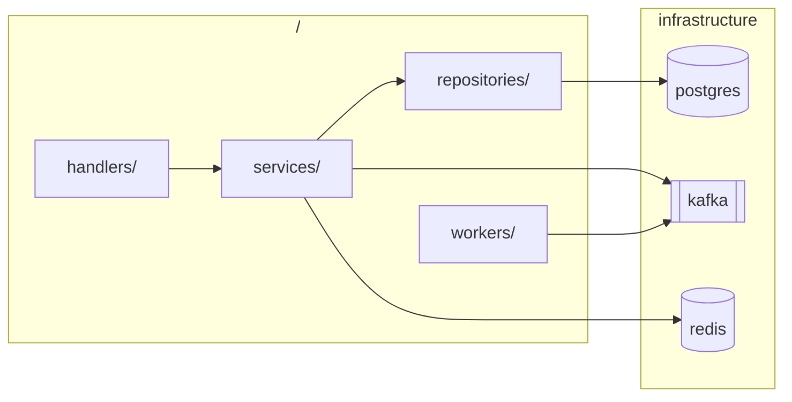

#### Existing Code Anchors
The exact files the agent must read **before** writing new code.
| Path | Why the agent reads it | What pattern it teaches |
|---|---|---|
| [REQUIRED — e.g. `internal/orders/repository.go`] | [REQUIRED — "matches transactional write pattern we extend"] | [REQUIRED — "uses `WithTx` + outbox row in same trx"] |

#### Existing Contracts to Reuse, Extend, or Replace
| Contract (endpoint / table / event) | Status (reuse / extend / new-with-justification) | Justification | Owner |
|---|---|---|---|
| [REQUIRED] | [REQUIRED] | [REQUIRED — only required for `new-with-justification`] | [REQUIRED] |

#### Patterns to Follow (and where to find them)
| Concern | Pattern in repo | Reference file | Deviation in this RFC? |
|---|---|---|---|
| HTTP handler shape | [REQUIRED] | [REQUIRED] | [REQUIRED or "none"] |
| Repository / DB access | [REQUIRED] | [REQUIRED] | [REQUIRED or "none"] |
| Queue producer/consumer | [REQUIRED] | [REQUIRED] | [REQUIRED or "none"] |
| Error response shape | [REQUIRED] | [REQUIRED] | [REQUIRED or "none"] |
| Logging / tracing | [REQUIRED] | [REQUIRED] | [REQUIRED or "none"] |

#### Reading Order for the Agent
1. [REQUIRED — file path + 1-line "what to learn"]
2. [REQUIRED]
3. …

#### Source Verification _(anti-hallucination — required)_
One row per anchor / pattern / contract above. Confirm each path is real and
opened, with concrete evidence. If any row cannot be filled, treat it as a
blocker (move to §5 Open Questions) — do not invent.

| Anchor / pattern / contract | Verified by | Evidence (1-line: function name, exported symbol, line range, or quoted identifier) |
|---|---|---|
| [REQUIRED — same path as above] | read / ls / grep | [REQUIRED — e.g. "`OrderRepository.WithTx` at L23; outbox row inserted L51"] |

### Detail 2.1 — Architecture (mermaid)

#### Component diagram
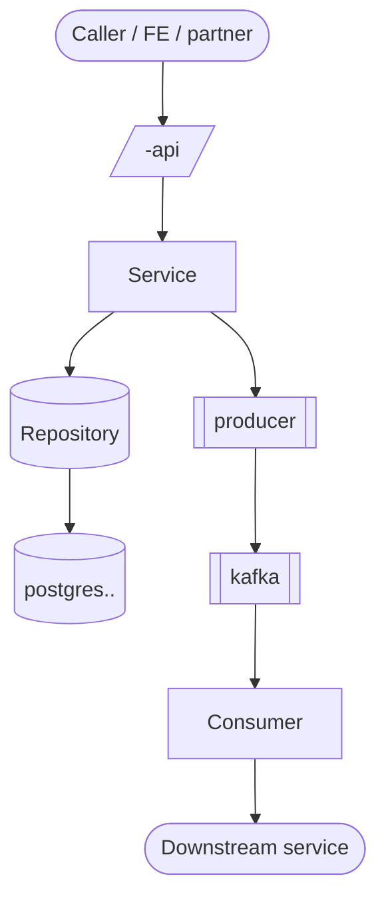

#### Data model (mermaid `erDiagram`)
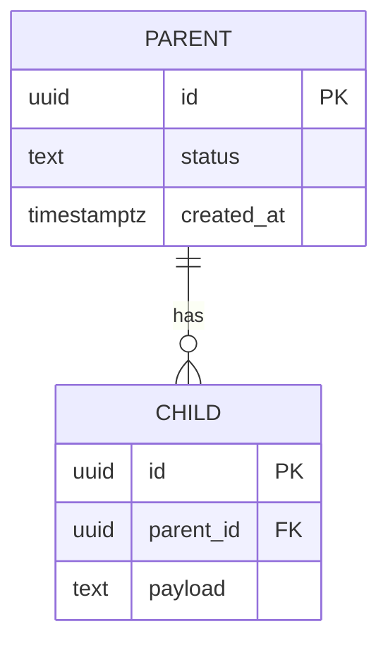

#### State machine for every status enum
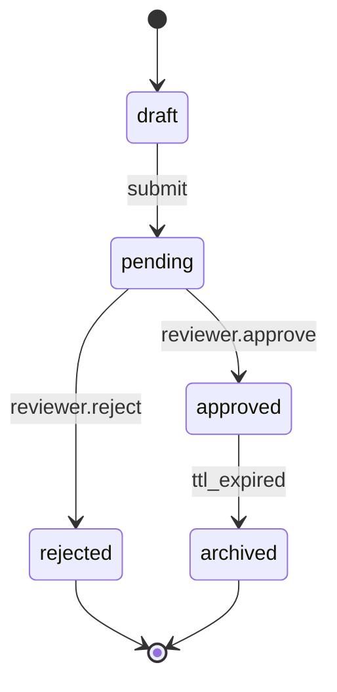

#### Branch & skip flow (one diagram per non-error policy branch)
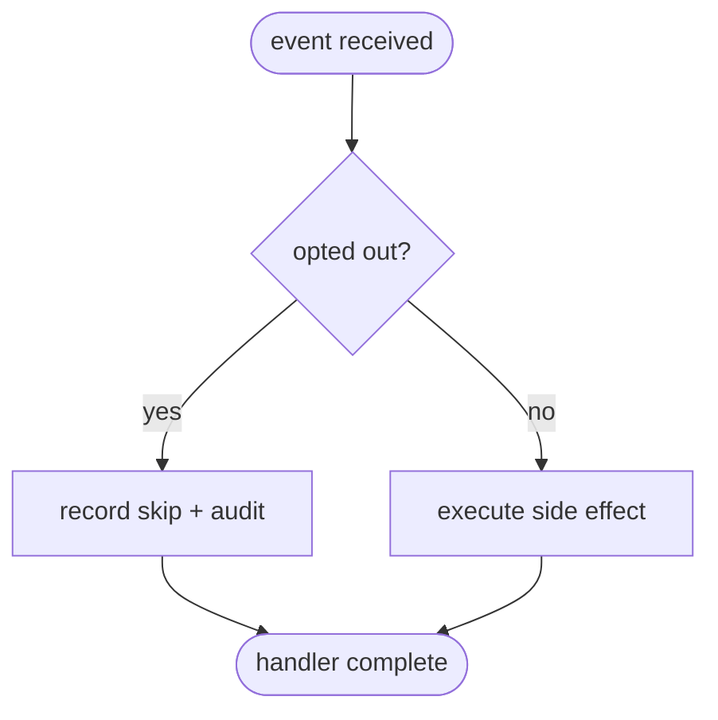

### Detail 2.2 — Sequence (mermaid, one per scenario incl. failure paths)
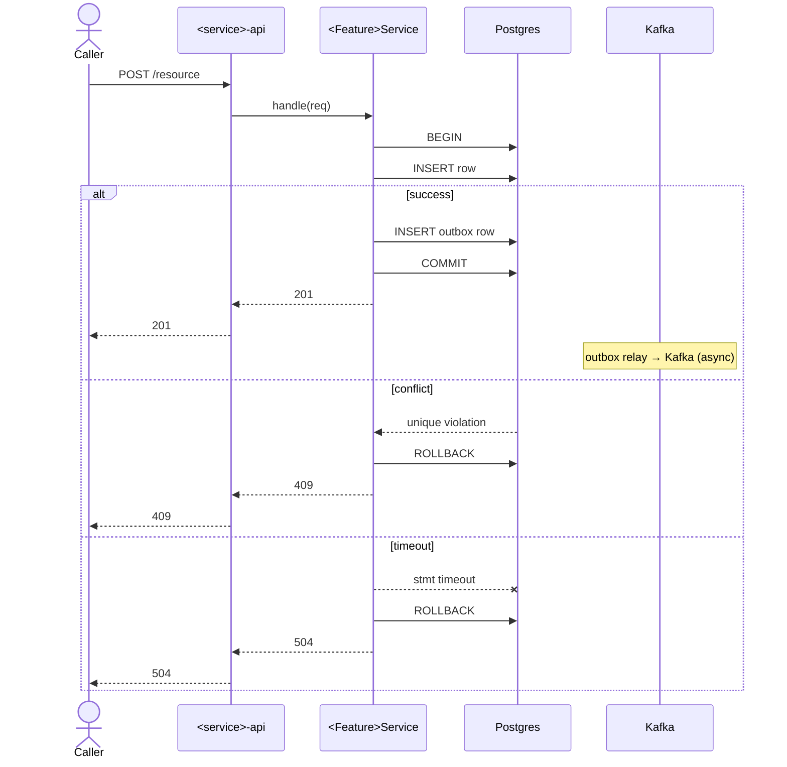

### Detail 2.3 — Database Model (DDL)
[REQUIRED: full DDL for every new or altered table.]
```sql
CREATE TABLE [REQUIRED] (
  [REQUIRED: column TYPE NOT NULL DEFAULT … CHECK (…) REFERENCES …]
);
CREATE INDEX [REQUIRED: name] ON [REQUIRED] ([REQUIRED]);  -- supports query: [REQUIRED]
```
- Cardinality estimate + growth projection: [REQUIRED]
- Example rows: [REQUIRED]
- PII classification per column: [REQUIRED]
- Retention policy per table: [REQUIRED]
- **Per-status lifecycle** for every table with a status enum:
  | Status value | Visibility (default list / archived tab / hidden) | Retention | Restore semantics (allowed / blocked / time-bounded) | Transitions allowed |
  |---|---|---|---|---|
  | [REQUIRED — one row per enum value] | [REQUIRED] | [REQUIRED] | [REQUIRED] | [REQUIRED] |
- Partition / sharding key + rationale: [REQUIRED or "none"]
- NoSQL alternative considered + why rejected: [REQUIRED]

### Detail 2.4 — APIs
[REQUIRED: OpenAPI 3 / Swagger doc link encouraged. Contract MUST be consumer-ready
before development begins. Review with FE / mobile team for UX feasibility.
List **every** HTTP path the service serves — outbound (callers → us) AND inbound
webhooks (other services → us).]

#### Outbound endpoints (consumers call us)
| Endpoint | Method | AuthN/AuthZ (middleware + scope) | Request schema | Response schema | Status codes | Idempotency mechanism | Versioning | Reuse? |
|---|---|---|---|---|---|---|---|---|
| [REQUIRED] | [REQUIRED] | [REQUIRED] | [REQUIRED] | [REQUIRED] | [REQUIRED] | [REQUIRED] | [REQUIRED] | reused / extended / new-with-justification |

#### Inbound webhooks (other services call us)
| Endpoint | Method | AuthN/AuthZ | Source service | Request schema | Response schema | Status codes | Idempotency mechanism | Versioning |
|---|---|---|---|---|---|---|---|---|
| [REQUIRED] | [REQUIRED] | [REQUIRED] | [REQUIRED] | [REQUIRED] | [REQUIRED] | [REQUIRED] | [REQUIRED] | [REQUIRED] |

Per endpoint also include:
- Example request / response payloads per scenario
- Rate limits + payload size limits
- Pagination convention (offset vs cursor)
- Backward compatibility (preserved consumers vs deprecation window)

### Detail 2.A — Data Integrity Matrix
For every write path:
| Write path | Transaction scope (atomic with what) | Partial failure behavior | Idempotency key + TTL | Consistency model | Duplicate-event handling | Stale-read handling |
|---|---|---|---|---|---|---|
| [REQUIRED] | [REQUIRED] | [REQUIRED] | [REQUIRED] | strong / eventual | [REQUIRED] | [REQUIRED] |

### Detail 2.B — Concurrency Collision Map
For every shared resource:
| Resource | Writers (actors) | Collision scenario | Resolution mechanism (lock / optimistic / queue) | Behavior when lock fails / optimistic check fails |
|---|---|---|---|---|
| [REQUIRED] | [REQUIRED] | [REQUIRED] | [REQUIRED] | [REQUIRED] |

### Detail 2.C — Async Job / Event Consumer Spec
For every background worker / cron / queue consumer / event handler:
| Job/Consumer | Trigger | Input shape | Retry (attempts + backoff) | DLQ name + retention | Concurrency limit | Idempotency key | Per-message timeout | Poison-message handling |
|---|---|---|---|---|---|---|---|---|
| [REQUIRED] | [REQUIRED] | [REQUIRED] | [REQUIRED] | [REQUIRED] | [REQUIRED] | [REQUIRED] | [REQUIRED] | [REQUIRED] |

### Detail 2.D — Responsibility Boundary Matrix _(required when ≥ 2 services or squads collaborate)_

For every Behavior / flow that spans more than one service:

| Step (in execution order) | Owning squad / service | Inbound trigger | Outbound effect | Failure handler | PRD anchor |
|---|---|---|---|---|---|
| [REQUIRED] | [REQUIRED] | [REQUIRED] | [REQUIRED] | [REQUIRED] | [REQUIRED — PRD section / story] |

> Disagreements between this matrix and the PRD's allocation of work between
> squads are blockers — list them in Open Questions until reconciled.

### Detail 2.E — State Surface Contract

For every entity whose state is observable to a UI or a downstream consumer:

| Entity | State field / event | Default values | Updated by (handler / job / webhook) | Read via (endpoint / event) | Stale window |
|---|---|---|---|---|---|
| [REQUIRED] | [REQUIRED] | [REQUIRED] | [REQUIRED] | [REQUIRED] | [REQUIRED] |

> If a UI surface (Detail 1.A's UI Coverage table) needs progress / timeline /
> badge data, every contributing field appears here.

---

## 3. High-Availability & Security

[REQUIRED: HA plan — uptime / APDEX / SLA target; statelessness; horizontal-scale model;
behavior when dependencies are offline; transient-failure recovery; full-restart recovery
of database / queue / dependent services.]

### Performance Requirement
- Expected RPS sustained, p95, p99, max error rate (e.g., 500 RPS, p99 < 500ms, 0.01% error): [REQUIRED]
- Scalability measures (HPA metric, read replicas, cache strategy with stampede protection): [REQUIRED]
- Load test plan (concurrent users, ramp profile, sustain duration, request mix): [REQUIRED]

### Monitoring & Alerting
- RED metrics (Rate / Errors / Duration) — exact metric names + tags: [REQUIRED]
- USE metrics (Utilization / Saturation / Errors) where relevant: [REQUIRED]
- Trace span names + parent-child relationships: [REQUIRED]
- Alert thresholds + escalation path: [REQUIRED]
- SLO targets (availability, latency, error budget over 30d): [REQUIRED]
- Dashboard location / spec: [REQUIRED]
- "Debug at 3am" runbook for complex paths: [REQUIRED]

### Logging
- Structured log fields per path + level: [REQUIRED]
- PII removed from logs (which fields scrubbed): [REQUIRED]

### Security Implications
- Threat model (attacker intent + entry points): [REQUIRED]
- AuthN / AuthZ at every trust boundary — express as the matrix below:

#### Role × Endpoint Authorization Matrix
| Role | Endpoint(s) | Permitted methods | Tenant scope (own / cross-tenant / global) | Additional constraint (e.g. read-only, undo-window) | Audit trail |
|---|---|---|---|---|---|
| [REQUIRED — every role from Detail 1.A Role Coverage] | [REQUIRED] | [REQUIRED] | [REQUIRED] | [REQUIRED] | [REQUIRED] |

> Any role from Detail 1.A that has zero rows here is a blocker — either grant
> access or document why the service does not serve that role.

- Ownership validation (e.g., `order.user_id = jwt.sub`) + enforcement layer: [REQUIRED]
- Input validation rules per field (length / charset / enum / format / cross-field): [REQUIRED]
- Injection mitigations (SQL via parameterization/ORM, command, SSRF on outbound URLs): [REQUIRED]
- Secrets storage + rotation (Hashi Vault / env / config) + log-leak prevention: [REQUIRED]
- Audit logging (action / fields / sink): [REQUIRED]
- Rate limiting per user-triggered endpoint: [REQUIRED]
- Tenancy isolation enforcement point: [REQUIRED]
- Static analysis tool (Brakeman / phpcs-security-audit / SonarScan / similar): [REQUIRED]
- Public-exposure protections (whitelist domain/IP, DDoS, pen-test plan): [REQUIRED if exposed]
- ISO 27001 / 27701 compliance touchpoints: [REQUIRED]

### Detail 3.A — Failure Mode & Retry Catalog
| External call | Timeout | Retries (count + backoff) | Circuit breaker (threshold + window) | DLQ + retention | Caller behavior on persistent failure |
|---|---|---|---|---|---|
| [REQUIRED] | [REQUIRED] | [REQUIRED] | [REQUIRED] | [REQUIRED] | [REQUIRED] |

### Detail 3.A.1 — Branch & Skip Catalog

Non-error flow branches that change downstream behavior (e.g. opt-out → skip,
suppress flag → skip, dry-run → no-op). Distinct from failure modes.

| Branch trigger | Where it is checked (squad + step) | Downstream effect | Audit trail | User-visible? |
|---|---|---|---|---|
| [REQUIRED — every PRD-named skip / opt-out / suppress] | [REQUIRED] | [REQUIRED] | [REQUIRED] | yes/no |

### Detail 3.B — Error Response Catalog
Consistent error response shape across all endpoints:
```json
{ "error": "CODE", "message": "human-readable", "details": {} }
```
| Endpoint | Error code | HTTP status | Message | When it occurs | User-facing? |
|---|---|---|---|---|---|
| [REQUIRED] | [REQUIRED] | [REQUIRED] | [REQUIRED] | [REQUIRED] | yes/no |

### Detail 3.C — Compliance & Data Governance _(when triggered)_
Trigger if RFC touches PII, payment, health data, user-generated content retention,
auth logs, audit trails, or cross-border data transfer.
| Field | Classification (PII / sensitive / public) | Legal basis (UU PDP / GDPR clause) | Retention | Encryption (rest + transit) | Access audit | Right-to-delete path |
|---|---|---|---|---|---|---|
| [REQUIRED] | [REQUIRED] | [REQUIRED] | [REQUIRED] | [REQUIRED] | [REQUIRED] | [REQUIRED] |

> If no trigger, write: `N/A — no compliance trigger; verified no PII / payment / health / audit data touched.`

---

## 4. Backwards Compatibility and Rollout Plan

### Compatibility
- Existing endpoints / request / response shapes changed: [REQUIRED or "none"]
- Compatibility window (how long old behavior maintained): [REQUIRED]
- Consumer notification plan + timeline: [REQUIRED]
- API version strategy (additive / breaking + deprecation window): [REQUIRED]

### Rollout Strategy
- Migration sequence (e.g., add nullable column → backfill → dual-write → switch reads → drop): [REQUIRED]
- Schema state DURING migration (intermediate state explicit, not just start/end): [REQUIRED]
- Backfill (batch size / rate / ETA / production traffic impact): [REQUIRED]
- Feature flag (name, default state, targeting, kill-switch behavior): [REQUIRED]
- Rollout stages with go/no-go evidence: internal → 1% → 10% → 100% [REQUIRED per stage]
- Rollback trigger (specific metric / error pattern thresholds): [REQUIRED]
- Rollback mechanism + treatment of data written during rollout: [REQUIRED]
- PIC + timeline per stage: [REQUIRED]

### Detail 4.A — Configuration Contract
| Env var / config / flag | Type | Default | Required | Provisioner | Secret? |
|---|---|---|---|---|---|
| [REQUIRED] | [REQUIRED] | [REQUIRED] | yes/no | [REQUIRED] | yes/no |

### Detail 4.B — Test Plan (commands the agent will run)
**Commands must be sourced from the repo** (`Makefile`, `Justfile`,
`.github/workflows/*`, `Taskfile.yml`, etc.) — do not invent.
| Layer | Command (source: file + line) | What it must prove |
|---|---|---|
| Unit | [REQUIRED — e.g. `go test ./internal/<feature>/...` (source: `Makefile:42`)] | [REQUIRED] |
| Integration (real DB) | [REQUIRED — e.g. `make test-integration` (source: `Makefile:55`)] | [REQUIRED] |
| Contract | [REQUIRED — e.g. `make test-contract`] | [REQUIRED] |
| Load | [REQUIRED or "n/a — reason"] | [REQUIRED] |

### Detail 4.C — Agent Execution Plan
Each chunk is a discrete unit the agent executes and verifies. **Order matters**:
the agent finishes chunk N (and its acceptance criteria pass) before opening N+1.

| Order | Chunk | Files to modify/create | Commands to run | Acceptance criteria (verifiable) |
|---:|---|---|---|---|
| 1 | [REQUIRED — e.g. "Add migration for <table>"] | [REQUIRED — exact paths, e.g. `migrations/2026xxxx_add_<table>.up.sql`] | [REQUIRED — e.g. `make migrate-up`] | [REQUIRED — e.g. "table exists; index `idx_<x>` present; rollback works"] |

### Detail 4.D — Verification & Rollback Recipe
- **Pre-merge verification commands** (the agent runs these in order):
  1. [REQUIRED — e.g. `make lint`]
  2. [REQUIRED — e.g. `make test`]
  3. [REQUIRED — e.g. `make build`]
- **Post-deploy verification signals** (named metric / log query / dashboard URL):
  - [REQUIRED — e.g. "Datadog dashboard `<service>-overview`: error rate < 0.1% over 15min"]
- **Rollback recipe** (concrete steps, in order, the agent can execute):
  1. [REQUIRED — e.g. "Toggle flag `<feature>` off"]
  2. [REQUIRED — e.g. "Run `make migrate-down` if DDL was applied"]
  3. [REQUIRED — e.g. "Confirm consumer lag < 1min"]

### Detail 4.E — Resource & Cost Notes _(advisory)_
- Compute footprint (pods / CPU / memory / autoscale range): [REQUIRED or "no impact"]
- DB load delta + connection delta vs current headroom: [REQUIRED]
- Network egress (cross-AZ / cross-region / external API calls): [REQUIRED]
- Storage growth per table per month + retention impact: [REQUIRED]
- New infra components + estimated cost / licensing: [REQUIRED]

---

## 5. Concern, Questions, or Known Limitations

[REQUIRED: open questions for reviewer; known limits (rate limit, machine cap, queue depth);
future scalability plan (partitioning, sharding) with timeframe.]

---

## 6. Comment logs

| **Date** | **Comment(s) From** | **Action Item(s)** |
| --- | --- | --- |
|  |  |  |
|  |  |  |

---

## 7. Ready for agent execution

- yes | no
- If no, list exactly what is missing from these execution-readiness gates:
  - **§1 PRD-to-Schema Derivation** — every PRD-described entity / attribute / rule mapped to table.column, endpoint/event, and enforcement point (no Figma needed for backend RFCs)
  - **Detail 1.C Per-Story Change Map** — every PRD user story has exactly one row with layer scope + concrete BE changes + verifiable AC; out-of-scope stories say `n/a — covered in <FE RFC link>`
  - Repo Reading Guide (Detail 2.0) — anchors named, contracts to reuse classified, reading order set
  - **Source Verification table complete** — every anchor / pattern / contract has concrete evidence (no plausible-but-unverified rows)
  - Mermaid diagrams: component, ER, state, sequence, branch/skip
  - DDL complete with per-status lifecycle table; every row traces back to a §1 PRD-to-Schema row
  - APIs table: outbound + inbound webhooks; every new endpoint tagged reused/extended/new-with-justification
  - Data Integrity Matrix complete; Concurrency Collision Map complete
  - Async Job / Event Consumer Spec complete (timeouts, DLQ, idempotency)
  - Responsibility Boundary Matrix complete (when ≥ 2 services collaborate)
  - Failure Mode & Retry Catalog complete; Branch & Skip Catalog complete; Error Response Catalog complete
  - Configuration Contract complete; flag named with default
  - Agent Execution Plan: every chunk has files + commands + acceptance criteria
  - Verification & Rollback Recipe: commands runnable; signals named

> Optional: hand off to `rfc-reviewer` for a second-pass score after this gate
> is `yes`. The reviewer is supplementary; this gate is the agent-execution
> contract.
````

---

## Full-Stack RFC Template

````markdown
---
status: IDEA              # IDEA | RFC | ABANDON | AGREED
type: full-stack
sub_type:
  frontend: new-feature   # new-feature | enhancement | performance
  backend: new-feature    # new-feature | enhancement | tech-improvement
title: <RFC title>
owner: <team>             # e.g. Talenta Growth
authors:
  - <name>
reviewers:
  - <name>                # tech reviewers across affected squads (FE + BE)
approvers:
  - <name>                # tech leaders + infosec approver
submitted_date: YYYY-MM-DD
last_updated: YYYY-MM-DD
target_release: <vX.Y.Z | YYYY-Qn | YYYY-MM-DD>
related_documents:
  - <PRD link or path>    # at least one, or "no-PRD — reason"
discussion: <Slack channel / thread URL>
---

# RFC: <title>

> **Document Conventions** _(do not remove)_
>
> This RFC follows the Qontak RFC Template format for governance — the
> metadata table, Confluence sections **1–6**, and **Comment logs** are
> mandatory. Replace placeholder values; mark sections `N/A — reason` when
> truly inapplicable rather than deleting them.
>
> It is also **agent-execution-ready**: the §1 Design References (FE half)
> + §1 PRD-to-Schema Derivation (BE half), §2 Repo Reading Guide (Detail
> 2.0) for both layers, mermaid diagrams, the §2.G Cross-Layer Contract
> Verification, and §4 Agent Execution Plan + Verification & Rollback
> Recipe must be complete before §7 Ready for agent execution: yes.
>
> The YAML frontmatter at the very top is the machine-readable index agents
> parse. The metadata table below is the human-readable governance record.
> **Both must agree** on every shared field (status, owner, type, dates).

## Metadata

| Field | Value | Notes |
| --- | --- | --- |
| **Status** | <status_value> | `IDEA` / `RFC` / `ABANDON` / `AGREED` |
| **Owner** | <owner_value> | Team owning the RFC (e.g. Talenta Growth) |
| **Author(s)** | <author_value> | Primary author(s) |
| **Reviewers** | <reviewer_value> | Tech reviewers across affected squads (FE + BE) |
| **Approver(s)** | <approver_value> | Tech leaders + **infosec approver** |
| **Submitted Date** | <submitted_date> | ISO-8601 (`YYYY-MM-DD`); date RFC opened for discussion |
| **Last Updated** | <last_updated> | ISO-8601; bump on every material edit |
| **Target Release** | <target_release> | Version, quarter, or date |
| **Related Documents** | <related_docs_value> | PRD, design, prior RFCs (at least one — or `no-PRD — reason`) |
| **Discussion** | <discussion_value> | Slack channel / thread URL |

**Type:** full-stack
**Frontend sub-type:** new-feature | enhancement | performance
**Backend sub-type:** new-feature | enhancement | tech-improvement

## Sections at a Glance

1. Overview _(incl. §1 Design References — FE half, and §1 PRD-to-Schema Derivation — BE half)_
2. Technical Design _(Repo Reading Guide for both layers → end-to-end mermaid → DDL → APIs → cross-layer contract verification)_
3. High-Availability & Security
4. Backwards Compatibility and Rollout Plan _(incl. cross-layer rollout matrix, §4 Agent Execution Plan, Verification & Rollback Recipe)_
5. Concern, Questions, or Known Limitations
6. Comment logs
7. Ready for agent execution

---

## 1. Overview

[REQUIRED: problem statement spanning user + system outcome.]

### Success Criteria
[REQUIRED]

### Out of Scope
[REQUIRED]

### Related Documents
[REQUIRED]

### Assumptions
[REQUIRED]

### Dependencies
[REQUIRED — both layers]

### Design References _(frontend half — required)_
For every UI surface in scope, name the Figma frame, design system version,
and design QA contact. Both layers' contracts must satisfy what these frames
require.

| PRD-named surface | Figma / design link | Frame name | Design system version | Design QA contact | Notes |
|---|---|---|---|---|---|
| [REQUIRED] | [REQUIRED — direct frame link] | [REQUIRED] | [REQUIRED — e.g. `@mekari/ds@4.7.2`] | [REQUIRED] | [REQUIRED] |

If no Figma frame exists yet for a surface, write `n/a — design pending` and
add the missing frame to §5 Open Questions; do not start frontend chunks
against imagined designs.

### PRD-to-Schema Derivation _(backend half — required)_

> The backend half does **not** consume Figma. It derives entities,
> attributes, and business rules from the PRD as a domain spec. The bridge to
> the frontend is §2.G Cross-Layer Contract Verification: every API contract
> must satisfy both the design (Figma frames above) and the derived schema
> (this table).

For every entity, attribute, or business rule the PRD describes, derive what
the backend must persist, expose, or enforce.

| PRD-described entity / attribute / rule | Persisted as (table.column) | Exposed via (endpoint / event) | Enforced where (handler / DB constraint / consumer / job) | Source (PRD section #) |
|---|---|---|---|---|
| [REQUIRED — e.g. "user can revoke consent within 30 days"] | [REQUIRED — e.g. `consents.revoked_at timestamptz`] | [REQUIRED — e.g. `DELETE /consents/:id`] | [REQUIRED — e.g. handler `ConsentService.Revoke` + DB CHECK + nightly purge] | [REQUIRED — e.g. PRD §4.1] |

> Every row in §2.3 Database Model and every endpoint in §2.4 APIs must trace
> back to either a Figma frame (above) **or** a row in this table — typically
> both. Missing trace = blocker, surface as Open Question.

### Detail 1.A — PRD Traceability (cross-layer)
Forward:
| PRD requirement | FE section / component | BE section / endpoint |
|---|---|---|
| [REQUIRED] | [REQUIRED] | [REQUIRED] |

Reverse:
| New FE component / BE endpoint / dependency | PRD need |
|---|---|
| [REQUIRED] | [REQUIRED] |

#### UI / Consumer Surface Coverage
| PRD-named surface | Consumer | Required reads (BE) | Required writes (BE) | FE component | Status surface (which field/event reflects state) |
|---|---|---|---|---|---|
| [REQUIRED — every page/modal/panel/chatbot flow/magic-link view from PRD] | web/chatbot/mobile/support | [REQUIRED] | [REQUIRED] | [REQUIRED] | [REQUIRED] |

#### Role Coverage
| PRD role | Authorization mechanism | Endpoints permitted (BE) | UI surface visibility (FE) | Cross-tenant? | Audit trail |
|---|---|---|---|---|---|
| [REQUIRED — every role from PRD, including support / read-only / internal] | [JWT scope / magic-token / service token / IP allowlist] | [REQUIRED] | [REQUIRED] | yes/no | [REQUIRED] |

#### PRD Section Coverage
| PRD section # | Title | Where covered (RFC section) or `n/a — reason` |
|---|---|---|
| [REQUIRED — one row per numbered PRD section] | [REQUIRED] | [REQUIRED] |

> Cross-layer check: flag any PRD requirement where FE and BE RFC sections contradict on
> scope or behavior. These are blockers.

### Detail 1.B — Decisions Closed (cross-layer)
| Decision | Chosen option | Alternatives rejected | Why rejected | Layer |
|---|---|---|---|---|
| [REQUIRED] | [REQUIRED] | [REQUIRED — or `no alternative considered — [reason]`] | [REQUIRED — or `n/a — single viable option`] | FE / BE / both |

> Honesty rule: if no alternative was seriously considered, write `no
> alternative considered — [reason]` rather than fabricate a rejected option.

The decision table MUST close, at minimum, the following (mark `n/a — reason` if truly inapplicable):
- Per-status lifecycle for each status enum (retention, visibility, restore semantics)
- Soft-delete vs hard-delete policy for each entity
- Cross-squad responsibility for every multi-step flow that spans services
- Inbound webhook (callback) ownership and shape for every async integration
- Opt-out / skip / branch policy ownership for non-error flow branches
- Reuse-vs-new decision for every newly proposed endpoint (`reused` / `extended` / `new-with-justification`)

> Explicitly note any decision where FE and BE could disagree (REST vs gRPC, offset vs cursor
> pagination, casing, error shape) and confirm both layers are aligned.

### Detail 1.C — Per-Story Change Map _(human-readable index, organised by user story)_

For every PRD user story in scope, list the FE and BE work side-by-side. This
is the **story-centric** index that complements Detail 1.A's technical-centric
matrices: a reviewer can scan one row to know exactly what a story requires
across both layers, and how to verify it — without crawling the DDL / APIs /
state / async tables in §2.

**Layer scope values** _(use the one that fits)_:

- `FE-only` — frontend changes only.
- `BE-only` — backend changes only.
- `FE + BE` — both layers (typical for full-stack RFCs).
- `Runtime / behavior` — no API surface change; behavior change at runtime
  (chat hub, worker, scheduled job).
- `Config` — feature flag, env var, design-system token, registry value only.
- `Cross-squad` — work owned by another squad (Billing, Platform, Data team,
  Design); link the issue or RFC.

| Story # | Story title (from PRD §13b) | Layer scope | FE changes (components / hooks / pages / events / Figma frames) | BE changes (endpoints / DDL keys / use cases / async jobs / events) | Acceptance criteria (verifiable) | RFC anchors |
|---|---|---|---|---|---|---|
| [REQUIRED — e.g. M1] | [REQUIRED — short title] | [REQUIRED — pick value(s) from list above] | [REQUIRED — bulleted; or `n/a — BE-only`] | [REQUIRED — bulleted; or `n/a — FE-only`] | [REQUIRED — assertable, tied to PRD §13b AC, e.g. "E2E spec passes; metric `<name>` count > 0 in 24 h; PaperTrail row written"] | [REQUIRED — RFC sections, e.g. "§2.4 row 1 · §2.A row 3 · §4.D chunk 5 · §1 PRD-to-Schema row 2 · §1 Design References row 1"] |

> Coverage rule: every PRD-listed user story must appear here exactly once.
> Silent omission is a blocker. If a story is intentionally deferred to a
> later phase, write `deferred — Phase 2.5 (reason)`.
>
> Cross-layer rule: every `FE + BE` row must have **both** the FE changes and
> BE changes columns filled. If only one half is filled, either the row is
> mis-tagged (it's actually `FE-only` or `BE-only`) or there's an unclosed
> dependency — surface it in §5 Open Questions.

---

## 2. Technical Design

### Detail 2.0 — Repo Reading Guide _(read this first; the agent must understand both layers as documentation before writing any new code)_

#### Repo Map (mermaid, both layers)
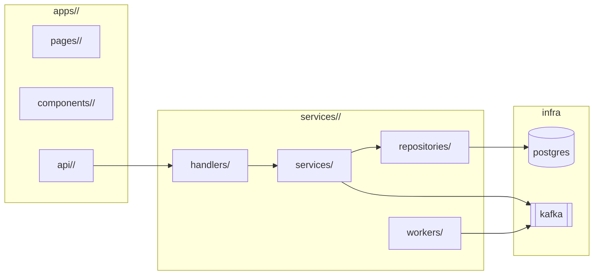

#### Existing Code Anchors
| Layer | Path | Why the agent reads it | What pattern it teaches |
|---|---|---|---|
| FE | [REQUIRED] | [REQUIRED] | [REQUIRED] |
| BE | [REQUIRED] | [REQUIRED] | [REQUIRED] |

#### Existing Contracts to Reuse, Extend, or Replace (BE)
| Contract (endpoint / table / event) | Status (reuse / extend / new-with-justification) | Justification | Owner |
|---|---|---|---|
| [REQUIRED] | [REQUIRED] | [REQUIRED — only required for `new-with-justification`] | [REQUIRED] |

#### Patterns to Follow (and where to find them)
| Layer | Concern | Pattern in repo | Reference file | Deviation? |
|---|---|---|---|---|
| FE | State management | [REQUIRED] | [REQUIRED] | [REQUIRED or "none"] |
| FE | Error / toast / retry | [REQUIRED] | [REQUIRED] | [REQUIRED or "none"] |
| BE | HTTP handler shape | [REQUIRED] | [REQUIRED] | [REQUIRED or "none"] |
| BE | Repository / DB access | [REQUIRED] | [REQUIRED] | [REQUIRED or "none"] |
| Cross | Naming convention (snake_case API → camelCase FE) + transformation layer | [REQUIRED] | [REQUIRED] | [REQUIRED or "none"] |

#### Reading Order for the Agent
1. [REQUIRED — file path + 1-line "what to learn"]
2. [REQUIRED]
3. …

#### Source Verification _(anti-hallucination — required)_
One row per anchor / pattern / contract above (both layers). Confirm each path
is real and opened, with concrete evidence. If any row cannot be filled, treat
it as a blocker (move to §5 Open Questions) — do not invent.

| Layer | Anchor / pattern / contract | Verified by | Evidence (1-line: function name, exported symbol, line range, or quoted identifier) |
|---|---|---|---|
| FE / BE | [REQUIRED — same path as above] | read / ls / grep | [REQUIRED — e.g. "`POST /orders` registered at `routes.go:L88`"] |

#### Design ↔ Code Mapping _(frontend half — required)_
For every Figma frame in §1 Design References, name the implementing file(s)
and tokens used. The bridge to the backend half lives in §2.G Cross-Layer
Contract Verification.

| Figma frame / component | Implementing file (path) | Reuse vs new | Design tokens used (color / space / typography) | Backing API endpoint(s) | Deviation from design |
|---|---|---|---|---|---|
| [REQUIRED] | [REQUIRED] | reused / extended / new | [REQUIRED — e.g. `color.surface.brand`, `space.4`, `text.heading.lg`] | [REQUIRED — endpoint(s) from §2.4] | [REQUIRED or "none — pixel-faithful"] |

> If a frame requires a deviation, the Design QA contact named in §1 Design
> References must approve before the chunk lands.

### Detail 2.1 — Architecture (mermaid)

#### End-to-end component diagram
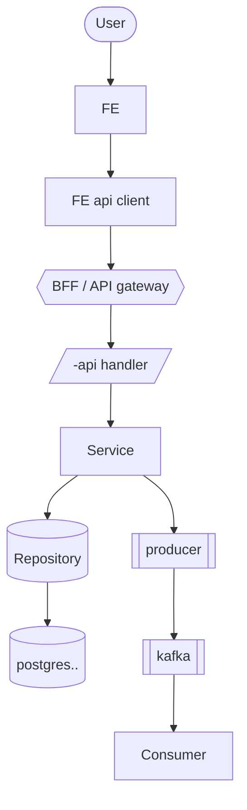

#### Data model (mermaid `erDiagram`)
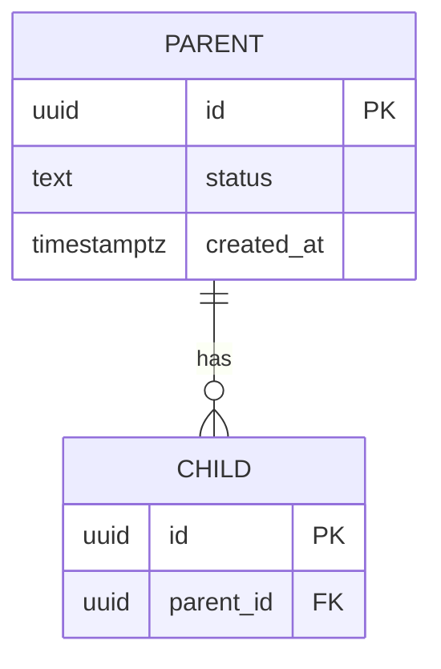

#### State machine for every status enum
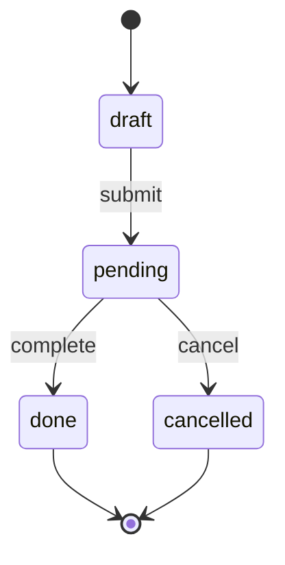

#### Branch & skip flow (one diagram per non-error policy branch)
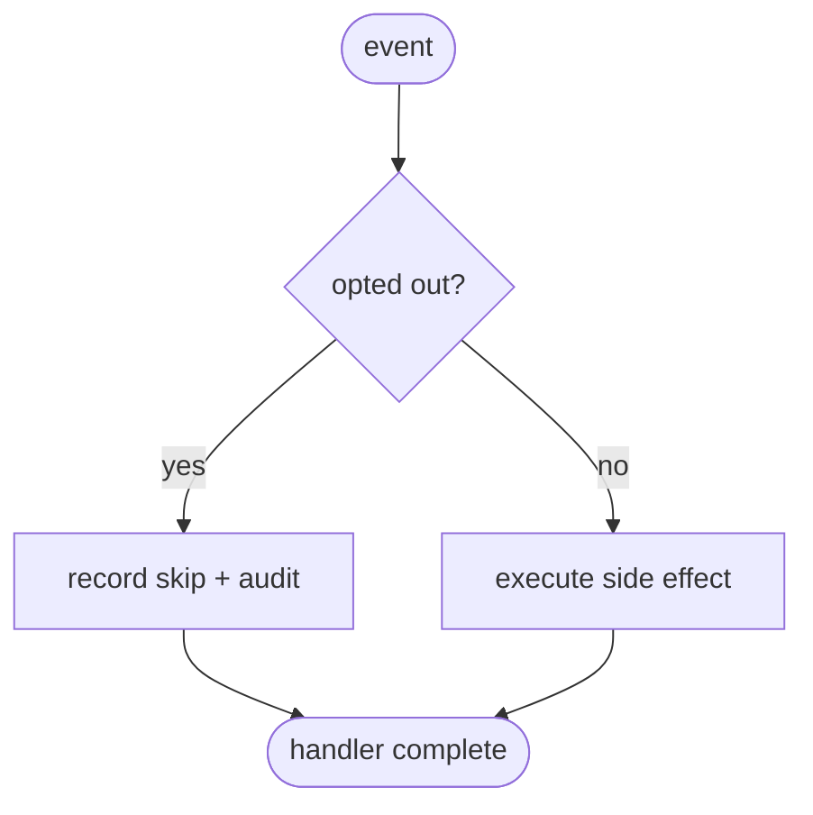

### Detail 2.2 — Sequence (mermaid, end-to-end per scenario incl. failure paths)
```mermaid
sequenceDiagram
  actor U as User
  participant FE as Web
  participant API as <service>-api
  participant SVC as <Feature>Service
  participant DB as Postgres
  U->>FE: submit form
  FE->>API: POST /resource
  API->>SVC: handle(req)
  SVC->>DB: BEGIN; INSERT; COMMIT
  alt 2xx
    SVC-->>API: 201
    API-->>FE: 201
    FE-->>U: success state
  else 409 conflict
    SVC-->>API: 409
    API-->>FE: 409
    FE-->>U: inline conflict message
  else timeout
    API-->>FE: 504
    FE-->>U: degraded view + retry CTA
  end
```

### Detail 2.3 — Database Model (DDL)
[REQUIRED: same DDL detail as Backend template Detail 2.3, including the
**Per-status lifecycle** sub-table for every table with a status enum.]

### Detail 2.4 — APIs
[REQUIRED: same as Backend template Detail 2.4 — split into **Outbound endpoints**
(consumers call us) and **Inbound webhooks** (other services call us). Each
outbound row carries a `Reuse?` column tagging the endpoint as `reused` /
`extended` / `new-with-justification`. Reference Swagger / OpenAPI.]

#### Outbound endpoints (consumers call us)
| Endpoint | Method | AuthN/AuthZ | Request schema | Response schema | Status codes | Idempotency | Versioning | Reuse? |
|---|---|---|---|---|---|---|---|---|
| [REQUIRED] | [REQUIRED] | [REQUIRED] | [REQUIRED] | [REQUIRED] | [REQUIRED] | [REQUIRED] | [REQUIRED] | reused / extended / new-with-justification |

#### Inbound webhooks (other services call us)
| Endpoint | Method | AuthN/AuthZ | Source service | Request schema | Response schema | Status codes | Idempotency | Versioning |
|---|---|---|---|---|---|---|---|---|
| [REQUIRED] | [REQUIRED] | [REQUIRED] | [REQUIRED] | [REQUIRED] | [REQUIRED] | [REQUIRED] | [REQUIRED] | [REQUIRED] |

### Detail 2.A — UI Contract
[Same structure as Frontend template Detail 2.A.]

### Detail 2.B — Data-Fetching Strategy
[Same as Frontend template Detail 2.B.]

### Detail 2.C — UI State Matrix
[Same as Frontend template Detail 2.C.]

### Detail 2.D — Data Integrity Matrix
[Same as Backend template Detail 2.A.]

### Detail 2.E — Concurrency Collision Map
[Same as Backend template Detail 2.B.]

### Detail 2.F — Async Job / Event Consumer Spec
[Same as Backend template Detail 2.C.]

### Detail 2.F.1 — Responsibility Boundary Matrix _(required when ≥ 2 services or squads collaborate)_
For every Behavior / flow that spans more than one service:
| Step (in execution order) | Owning squad / service | Inbound trigger | Outbound effect | Failure handler | PRD anchor |
|---|---|---|---|---|---|
| [REQUIRED] | [REQUIRED] | [REQUIRED] | [REQUIRED] | [REQUIRED] | [REQUIRED] |

> Disagreements between this matrix and the PRD's allocation of work between
> squads are blockers — list them in Open Questions until reconciled.

### Detail 2.F.2 — State Surface Contract
For every entity whose state is observable to a UI or a downstream consumer:
| Entity | State field / event | Default values | Updated by (handler / job / webhook) | Read via (endpoint / event) | Stale window |
|---|---|---|---|---|---|
| [REQUIRED] | [REQUIRED] | [REQUIRED] | [REQUIRED] | [REQUIRED] | [REQUIRED] |

> If a UI surface (Detail 1.A's UI Coverage table) needs progress / timeline /
> badge data, every contributing field appears here.

### Detail 2.G — Cross-Layer Contract Verification
| Endpoint | BE response schema | FE expected schema | Match? | Gaps (casing / nullability / error shape / pagination / auth) |
|---|---|---|---|---|
| [REQUIRED] | [REQUIRED] | [REQUIRED] | yes / no / partial | [REQUIRED] |

> Any "no" or "partial" → blocker. Add a transformation layer or align contracts.

### Detail 2.H — End-to-End Data Flow
For each major user action, trace the full path:
`User action → FE component → API call (method + path) → BE handler → service → DB write/read → response → FE state update → UI render`
- Side effects in the flow (events / notifications / audit logs): [REQUIRED]
- Step-by-step ownership (which layer / team owns each step): [REQUIRED]

### Detail 2.I — Scope Boundaries
- FE files create / modify / NOT touched: [REQUIRED]
- BE files create / modify / NOT touched: [REQUIRED]
- Shared modules touched + impact analysis: [REQUIRED]

### Detail 2.J — Asset Inventory _(frontend half)_
Every icon / illustration / image / lottie / font the FE introduces or swaps.

| Asset name | Type (icon / illustration / image / lottie / font) | Source (design system / new export from Figma / 3rd-party) | Format & sizes | Path in repo |
|---|---|---|---|---|
| [REQUIRED] | [REQUIRED] | [REQUIRED] | [REQUIRED] | [REQUIRED] |

> Use design-system assets where possible; flag every new asset for design
> review before merge.

---

## 3. High-Availability & Security

[REQUIRED: HA narrative covering both layers.]

### Performance Requirement
- Frontend: LCP / INP / CLS / bundle budget / browser support / a11y level — [REQUIRED]
- Backend: RPS / p95 / p99 / error rate / scalability measures / load test plan — [REQUIRED]

### Monitoring & Alerting
- FE: analytics events + error monitoring + Core Web Vitals dashboards: [REQUIRED]
- BE: RED/USE metrics + alerts + SLO + dashboards: [REQUIRED]
- Cross-layer: distributed traces FE → API → BE (trace ID propagation mechanism named): [REQUIRED]

### Logging
- FE log fields + level: [REQUIRED]
- BE structured log fields + level: [REQUIRED]
- PII removal across both layers: [REQUIRED]

### Security Implications
- Backend: full Backend §3 Security checklist
- Frontend: input sanitization + auth token handling + CSP
- Cross-layer: token refresh flow + session-invalidation propagation: [REQUIRED]

#### Role × Endpoint Authorization Matrix
| Role | Endpoint(s) | Permitted methods | Tenant scope (own / cross-tenant / global) | UI surface visibility (FE) | Additional constraint (e.g. read-only, undo-window) | Audit trail |
|---|---|---|---|---|---|---|
| [REQUIRED — every role from Detail 1.A Role Coverage] | [REQUIRED] | [REQUIRED] | [REQUIRED] | [REQUIRED] | [REQUIRED] | [REQUIRED] |

> Any role from Detail 1.A that has zero rows here is a blocker — either grant
> access or document why the service does not serve that role.

### Detail 3.A — Failure Mode Catalog (merged)
| Surface | FE behavior on failure | BE response on failure | Code-shape consistency check (FE handles BE's exact codes) |
|---|---|---|---|
| [REQUIRED] | [REQUIRED] | [REQUIRED] | yes/no |

### Detail 3.A.1 — Branch & Skip Catalog
Non-error flow branches that change downstream behavior (e.g. opt-out → skip,
suppress flag → skip, dry-run → no-op). Distinct from failure modes.
| Branch trigger | Where it is checked (squad + step) | Downstream effect | Audit trail | User-visible? |
|---|---|---|---|---|
| [REQUIRED — every PRD-named skip / opt-out / suppress] | [REQUIRED] | [REQUIRED] | [REQUIRED] | yes/no |

### Detail 3.B — Error Response Catalog (BE)
[Same as Backend template Detail 3.B.]

### Detail 3.C — Error Message Catalog (FE)
[Same as Frontend template Detail 3.B.]

### Detail 3.D — Compliance & Data Governance _(when triggered)_
[Same as Backend template Detail 3.C.]

### Detail 3.E — Accessibility
[Same as Frontend template Detail 3.C.]

---

## 4. Backwards Compatibility and Rollout Plan

### Compatibility
- BE compatibility window + API versioning: [REQUIRED]
- FE saved state / cache compatibility: [REQUIRED]
- Cross-layer compatibility (API contract evolution + transformation rules): [REQUIRED]

### Rollout Strategy
- **Deploy order** (FE first / BE first / simultaneous) + reasoning: [REQUIRED]
- Feature flag coordination — single flag or two? coupling rules + independent toggling: [REQUIRED]
- Rollback per layer + sequence: [REQUIRED]
- Stop conditions per layer: [REQUIRED]
- PICs + timeline per stage: [REQUIRED]

### Detail 4.A — Cross-Layer Rollout Compatibility Matrix
| Scenario | FE | BE | Works? | Mitigation |
|---|---|---|---|---|
| Pre-deploy | Old | Old | yes | baseline |
| Backend first | Old | New | [REQUIRED] | [REQUIRED] |
| Frontend first | New | Old | [REQUIRED] | [REQUIRED] |
| Both deployed | New | New | yes | target state |
| Backend rollback | New | Old (rolled back) | [REQUIRED] | [REQUIRED] |
| Frontend rollback | Old (rolled back) | New | [REQUIRED] | [REQUIRED] |

> Any "no" in this matrix MUST have a mitigation in the rollout plan or the deploy order
> must avoid that scenario.

### Detail 4.B — Configuration Contract
| Layer | Env var / flag | Type | Default | Required | Provisioner | Secret? |
|---|---|---|---|---|---|---|
| FE / BE | [REQUIRED] | [REQUIRED] | [REQUIRED] | yes/no | [REQUIRED] | yes/no |

### Detail 4.C — Test Plan (commands the agent will run)
**Commands must be sourced from each layer's repo config** (FE: `package.json`
scripts; BE: `Makefile` / `Justfile` / `Taskfile.yml`; CI:
`.github/workflows/*`) — do not invent.
| Layer | Command (source: file + line) | What it must prove |
|---|---|---|
| FE unit / integration | [REQUIRED] | [REQUIRED] |
| FE E2E | [REQUIRED] | [REQUIRED] |
| BE unit | [REQUIRED] | [REQUIRED] |
| BE integration (real DB) | [REQUIRED] | [REQUIRED] |
| Cross-layer integration | [REQUIRED — named scenarios crossing the API boundary] | [REQUIRED] |

### Detail 4.D — Agent Execution Plan
Each chunk is a discrete unit the agent executes and verifies. **Order matters**:
the agent finishes chunk N (and its acceptance criteria pass) before opening N+1.

| Order | Layer | Chunk | Files to modify/create | Commands to run | Acceptance criteria (verifiable) |
|---:|---|---|---|---|---|
| 1 | FE / BE / both | [REQUIRED] | [REQUIRED] | [REQUIRED] | [REQUIRED] |

### Detail 4.E — Verification & Rollback Recipe
- **Pre-merge verification commands** (the agent runs these in order, per layer):
  - FE:
    1. [REQUIRED]
    2. [REQUIRED]
  - BE:
    1. [REQUIRED]
    2. [REQUIRED]
- **Post-deploy verification signals** (named metric / log query / dashboard URL, both layers):
  - [REQUIRED]
- **Rollback recipe** (concrete steps, in deploy-order-aware sequence):
  1. [REQUIRED]
  2. [REQUIRED]
  3. [REQUIRED]

### Detail 4.F — Resource & Cost Notes _(advisory)_
[Same as Backend template Detail 4.E.]

---

## 5. Concern, Questions, or Known Limitations

[REQUIRED]

---

## 6. Comment logs

| **Date** | **Comment(s) From** | **Action Item(s)** |
| --- | --- | --- |
|  |  |  |
|  |  |  |

---

## 7. Ready for agent execution

- yes | no
- If no, list exactly what is missing from these execution-readiness gates:
  - **§1 Design References (FE half)** — every UI surface has Figma frame link, DS version, design QA contact
  - **§1 PRD-to-Schema Derivation (BE half)** — every PRD-described entity / attribute / rule mapped to table.column, endpoint/event, and enforcement point
  - **Detail 1.C Per-Story Change Map** — every PRD user story has exactly one row with layer scope + FE changes + BE changes + verifiable AC (FE+BE rows have both columns filled)
  - Repo Reading Guide (Detail 2.0) — anchors named for both layers, contracts to reuse classified
  - **Source Verification table complete** — every anchor / pattern / contract has concrete evidence per layer (no plausible-but-unverified rows)
  - **Detail 2.0 Design ↔ Code Mapping (FE half)** — every Figma frame mapped to implementing file + tokens + backing API endpoint
  - **Asset Inventory (Detail 2.J)** — every new FE asset has source, format, repo path
  - Mermaid diagrams: end-to-end component, ER, state, sequence (with failure paths), branch/skip
  - DDL complete with per-status lifecycle table; every row traces back to a §1 PRD-to-Schema row
  - APIs table: outbound + inbound webhooks; every new endpoint tagged reused/extended/new-with-justification; every endpoint satisfies both a Figma frame and a PRD-to-Schema row
  - Cross-Layer Contract Verification: every endpoint Match? = yes
  - End-to-End Data Flow traced for every major user action
  - UI State Matrix complete; Failure Mode Catalog (merged) complete; Error catalogs aligned
  - Cross-Layer Rollout Compatibility Matrix complete; deploy order chosen
  - Configuration Contract complete (per layer); flag coordination explicit
  - Agent Execution Plan: every chunk has layer + files + commands + acceptance criteria
  - Verification & Rollback Recipe: commands runnable per layer; signals named

> Optional: hand off to `rfc-reviewer` for a second-pass score after this gate
> is `yes`. The reviewer is supplementary; this gate is the agent-execution
> contract.
````
